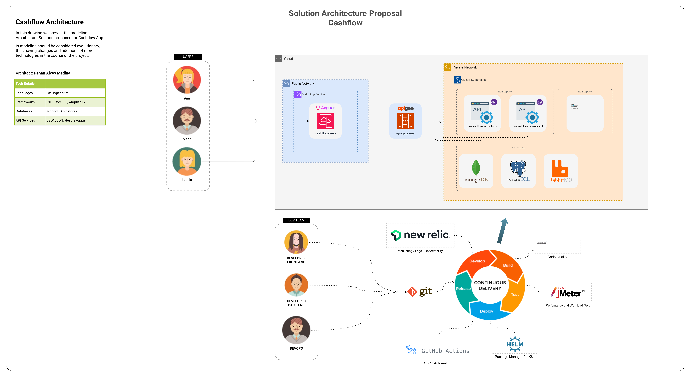

# Cashflow App

O cashflow é um projeto para demonstração de técnicas de arquitetura e desenvolvimento de software. Funcionamente ele tem a função de demonstrar dados analiticos da movimentação de caixa de uma empresa ou mesmo pessoa fisica.
Features já desenvolvidas neste projeto:
- Visão geral do caixa;
- Gestão de transações, com inclusão manual de trasanções, inclusão massiva via csv, edição e deleção de transações;
- Relatório consolidado do balanço de caixa diário e mensal.

Estas features atendem os requisitos funcionais onde um gestor pode controlar seu fluxo de caixa, lançando dos débitos e créditos, tendo de facil visualização o relatório diario do balanço de caixa.

O projeto implementa requisitos técnicos como: APIs, Microsserviços, Events, Dados distribuidos, DDD.

## Como executar a aplicação

### Pré requisitos:
- _Docker_
- _Garanta que os 4 serviços do compose estão up. (MongoDB, Postgres, RabbitMQ, Keycloack)_
- _.NET 8_
- _Node +20_
- _NPM_
- _Visual Studio/VS Code_

**1 - Execute o docker-compose com as ferramentas necessárias para o ambiente.**
> Na pasta raiz do projeto `cashflow`
```sh
docker-compose up -d
```

**2 - Execute o serviço ms-cashflow-transactions**
> Na pasta `ms-cashflow-transactions`, execute os comando abaixo:
```sh
dotnet restore .\Cashflow.Transactions.Api\Cashflow.Transactions.Api.csproj

dotnet run --project .\Cashflow.Transactions.Api\Cashflow.Transactions.Api.csproj
```

**3 - Execute o serviço ms-cashflow-management**
> Na pasta `ms-cashflow-management`, execute os comando abaixo:
```sh
dotnet restore .\Cashflow.Management.Api\Cashflow.Management.Api.csproj

dotnet run --project .\Cashflow.Management.Api\Cashflow.Management.Api.csproj
```

**4 - Execute o FrontEnd**
> Na pasta `fe-cashflow-web`, execute os comando abaixo:
```sh
npm install

ng serve
```

## Arquitetura de Soluções


> As ferramentas incluídas no desenho de solução como New Relic, SonarQube, ApiGee, JMeter, Github Actions, Helm, são ferramentas que recomendo dado as caracteristicas do projeto, mas podem ser modificadas dado as escolhas do cliente ou por questões de negociação de licenciamento.

**Você também pode acessar os diagramas C4 do projeto aqui:** [**_C4 Diagrams_**](docs/C4-Diagrams.md)

## ADRs
Abaixo os links para os registros de decisões arquiteturais, no qual detalho a motivação para escolha de algumas ferramentas escolhidos para o projeto.

[**_ADR001 - MongoDB_**](docs/adr/ADR001-Mongodb.md)

[**_ADR002 - Postgres_**](docs/adr/ADR002-Postgres.md)

[**_ADR003 - Rabbitmq_**](docs/adr/ADR003-Rabbitmq.md)

[**_ADR004 - Keycloack_**](docs/adr/ADR004-Keycloack.md)

## Data Model
Abaixo os links para o desenho das entidades e da modelagem de dados.

[**_Transaction_**](docs/DataModel/Transaction.md)

[**_CashStatement_**](docs/DataModel/CashStatement.md)

[**_ConsolidatedTransactionHistory_**](docs/DataModel/ConsolidatedTransactionHistory.md)
